# SKALA Vue Project

프로젝트명: skala-vue

## Hands on

### 과제 0. Project Scaffolding

#### AboutView.vue 수정

`h1` 태그의 내용을 다음과 같이 수정했다.

```html
<template>
  <div class="about">
    <h1>Welcome to SKALA-VUE project!</h1>
  </div>
</template>
```

#### Vue Devtools 확인

Vue Devtools의 Overview에서 프로젝트 정보와 Vue 실행 환경을 확인했다.
Components에서 App과 AboutView의 컴포넌트 구조를 확인했다.

#### 실행 결과


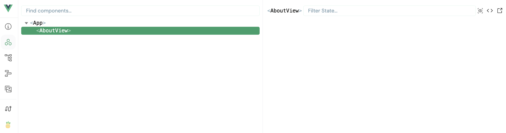

### 2. 과제 1 날씨 데이터 출력

파일 위치: `src/components/handon/HandOnFirst.vue`

#### 배열 렌더링

`v-for`를 사용하여 날씨 카드를 반복 출력하고 `:key`에 도시의 `id`를 바인딩했다.

```html
<div
  v-for="weather in weatherList"
  :key="weather.id"
  :class="[
    'weather-card',
    weather.temp >= 25 ? 'hot-card' : 'cool-card',
    selectedCity === weather.name ? 'selected-card' : '',
  ]"
  @click="selectedCity = weather.name"
>
  <div class="weather-info">
    <h3>{{ weather.name }} ({{ weather.status }})</h3>
    <p>현재 기온: {{ weather.temp }}°C</p>

    <p v-if="weather.temp >= 25" class="hot-label">🔥 더움 (25도 이상)</p>
    <p v-else class="cool-label">❄️ 선선함 (25도 미만)</p>
  </div>
</div>
```

#### 조건부 렌더링

25도 이상이면 `hot-label`, 25도 미만이면 `cool-label` 스타일과 문구를 출력한다.

```html
<p v-if="weather.temp >= 25" class="hot-label">🔥 더움 (25도 이상)</p>
<p v-else class="cool-label">❄️ 선선함 (25도 미만)</p>
```

#### 양방향 바인딩 및 한글 처리

`:value`와 `@input`을 사용하여 입력한 도시 이름을 화면에 출력한다. 과제 1에서는 입력 내용과 관계없이 모든 날씨 카드를 표시한다.

```html
<input
  type="text"
  :value="searchCity"
  placeholder="검색할 도시 이름 입력"
  @input="(e) => (searchCity = e.target.value)"
/>
<p>검색 중인 도시: {{ searchCity }}</p>
```

#### 이벤트 및 수식어

카드를 클릭하면 선택한 도시를 상태바에 출력한다. 상세보기 버튼에는 `@click.stop`을 사용하여 카드 클릭 이벤트의 버블링을 막았다.

```html
<div @click="selectedCity = weather.name">날씨 카드</div>

<button type="button" @click.stop="showDetail(weather.name, weather.status)">상세보기</button>

<div class="status-box">
  <p v-if="selectedCity">{{ selectedCity }}이 선택되었습니다.</p>
  <p v-else>카드를 클릭하거나 검색해 보세요.</p>
</div>
```

#### 개인 데이터 추가

기본 데이터에 대전의 날씨 정보를 추가했다.

```js
const weatherList = ref([
  { id: 'city_01', name: '서울', temp: 28, status: '맑음' },
  { id: 'city_02', name: '수원', temp: 24, status: '비' },
  { id: 'city_03', name: '부산', temp: 26, status: '구름' },
  { id: 'city_04', name: '대전', temp: 23, status: '흐림' },
])
```

#### 실행 화면

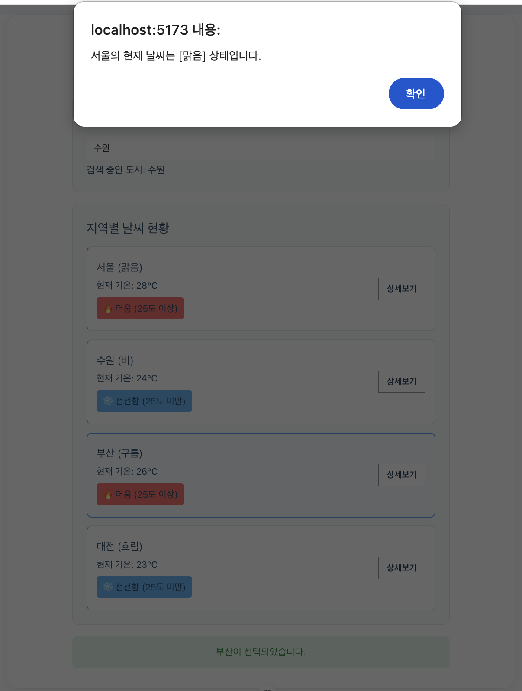

#### 배운 점

1. 검색값과 선택값의 상태 분리

   처음에는 검색창에 입력한 값을 `searchCity`에 저장하고, 같은 값을 하단 상태 박스에서도 사용했다. 이 때문에 검색창에 도시 이름을 입력하기만 해도 하단 상태 박스의 내용이 바로 변경되었다. 검색한 값과 카드를 클릭하여 선택한 값은 역할이 다르므로 `selectedCity` 변수를 별도로 만들었다. 검색창은 `searchCity`, 카드 선택 결과는 `selectedCity`가 담당하도록 분리하여 검색창 입력이 하단 상태 박스에 영향을 주지 않도록 수정했다.

2. `v-if`의 적용 범위

   처음에는 날씨 카드 전체 태그에 `v-if`를 적용하여 날씨에 따른 라벨을 표시하려고 했다. 그 결과 조건과 스타일이 카드 전체에 적용되는 문제가 발생했다. 도시 이름과 현재 기온처럼 항상 표시되는 부분은 공통으로 작성하고, 조건에 따라 달라지는 라벨 `<p>` 태그에만 `v-if`와 `v-else`를 적용했다. 이를 통해 카드의 공통 내용은 유지하면서 기온에 맞는 라벨만 다르게 표시할 수 있었다.

### 3. 과제 2 도시 검색 기능

파일 위치: `src/components/handon/HandOnSecond.vue`

과제 1에서 사용한 `weatherList`, `searchCity`, `selectedCity` 변수명을 유지하면서 `computed`, `watch`, `watchEffect`를 추가했다.

#### Computed를 이용한 도시 검색

검색어가 비어 있으면 원본 날씨 배열을 반환한다. 검색어가 있으면 `filter()`와 `includes()`를 사용하여 도시 이름에 검색어가 포함된 데이터만 `filteredWeatherList`에 저장한다.

```js
const filteredWeatherList = computed(() => {
  if (searchCity.value === '') {
    return weatherList.value
  }

  return weatherList.value.filter((weather) => weather.name.includes(searchCity.value))
})
```

#### watch와 watchEffect

`watch`로 선택된 도시의 변화를 감시하고, `watchEffect`로 검색어가 입력될 때마다 현재 검색어를 콘솔에 출력한다.

```js
watch(selectedCity, (newValue) => {
  console.log(`[watch 감지] 상태 바 문구가 업데이트 되었습니다 -> ${newValue}이 선택되었습니다.`)
})

watchEffect(() => {
  console.log(`[watchEffect 자동 호출] 현재 검색어: ${searchCity.value}`)
})
```

#### 검색 결과 표시

`filteredWeatherList`에 데이터가 있으면 해당 도시 카드를 출력하고, 데이터가 없으면 검색 결과 안내 문구를 출력한다.

```html
<div v-for="weather in filteredWeatherList" :key="weather.id" class="weather-card">
  <h3>{{ weather.name }} ({{ weather.status }})</h3>
</div>

<p v-if="filteredWeatherList.length === 0" class="no-result">
  검색 결과와 일치하는 도시가 없습니다.
</p>
```

#### 나만의 추가 기능

더운 도시 카드를 누른 횟수를 `hotCityClickCount`에 저장하고 상태바에 표시한다.

##### 나만의 반응형 변수

```js
const hotCityClickCount = ref(0)
```

##### 나만의 Computed

더운 도시 카드를 누른 횟수를 표시할 문구를 만든다.

```js
const hotCityClickMessage = computed(() => {
  return `더운 도시 카드 클릭 횟수: ${hotCityClickCount.value}회`
})
```

##### 나만의 Watcher

`hotCityClickCount`가 변경될 때마다 현재 클릭 횟수를 콘솔에 출력한다.

```js
watch(hotCityClickCount, (newValue) => {
  console.log(`더운 도시 카드를 ${newValue}번 클릭했습니다.`)
})
```

#### 실행 화면

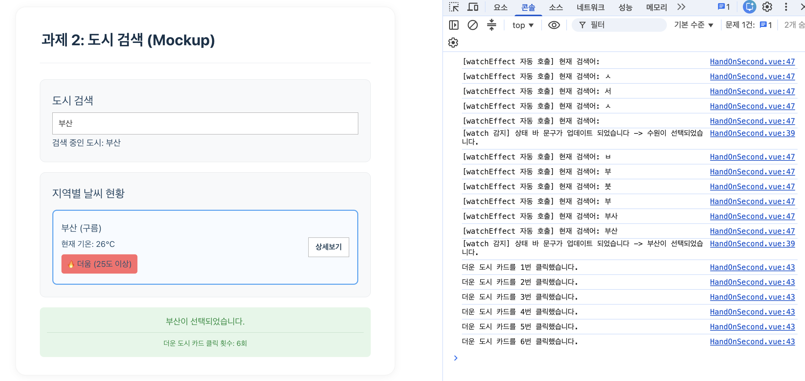

#### 배운 점

1. `computed`를 활용한 검색 결과 관리

   처음에는 `v-for`로 모든 도시를 반복하면서 각 카드에 `v-if`와 `v-else`를 적용했다. 이 방식은 검색어와 일치하지 않는 도시마다 “일치하는 도시가 없습니다.”라는 문구가 반복해서 출력되는 문제가 있었다. `filteredWeatherList`를 `computed`로 만들고 검색 조건에 맞는 도시 배열을 먼저 계산하도록 수정했다. 이후 계산된 배열만 `v-for`로 출력하고, 배열의 길이가 0일 때만 안내 문구를 한 번 표시하도록 구성했다. 이를 통해 검색 조건과 화면 출력 코드를 분리할 수 있었다.

2. `watch`와 `watchEffect`의 차이

   `watch`는 `selectedCity`, `hotCityClickCount`처럼 감시할 대상을 직접 지정하고, 값이 변경되었을 때 필요한 로그를 출력하는 데 사용했다. `watchEffect`는 함수 내부에서 사용하는 `searchCity`를 자동으로 추적하므로 검색어를 입력할 때마다 현재 검색어가 콘솔에 출력되었다. 이를 통해 특정 상태를 선택해서 감시할 때는 `watch`, 함수에서 사용하는 반응형 상태를 자동으로 감시할 때는 `watchEffect`를 사용할 수 있다는 점을 배웠다.

### 4. 과제 3 날씨 컴포넌트 분리

파일 위치: `src/components/handon/handon_third/`

과제 2의 반응형 상태와 기능은 `WeatherParent.vue`에 유지하고, 화면과 이벤트 역할을 여러 컴포넌트로 분리했다.

```text
WeatherParent.vue
├── BaseDashboardCard.vue
│   ├── SearchBar.vue
│   └── WeatherCard.vue
└── WeatherStatus.vue
```

#### WeatherParent.vue

모든 `ref`, `computed`, `watch`, `watchEffect`와 이벤트 처리 함수를 부모 컴포넌트에서 관리한다. 자식에게 Props를 전달하고 자식이 발생시킨 Emits를 받아 부모의 반응형 상태를 변경한다.

```html
<BaseDashboardCard title="도시 검색" icon="🔍">
  <SearchBar :query="searchCity" @update-query="updateSearchCity" />
</BaseDashboardCard>

<BaseDashboardCard title="지역별 날씨 현황" icon="🏙️">
  <WeatherCard
    v-for="weather in filteredWeatherList"
    :key="weather.id"
    :weather="weather"
    :is-selected="selectedCity === weather.name"
    @select-card="selectCity"
    @click-detail="showDetail"
  />
</BaseDashboardCard>
```

#### BaseDashboardCard.vue

검색 박스와 날씨 목록 박스에서 공통으로 사용하는 테두리, 여백, 배경 디자인을 담당한다. `<slot />` 위치에 부모가 전달한 `SearchBar` 또는 `WeatherCard`가 표시된다.

```html
<section class="dashboard-card">
  <h2>{{ icon }} {{ title }}</h2>
  <slot />
</section>
```

#### SearchBar.vue

부모로부터 `query`를 Props로 받아 검색어를 표시한다. 사용자가 입력하면 `update-query` 이벤트와 검색어를 부모에게 전달한다.

```js
defineProps({
  query: {
    type: String,
    required: true,
  },
})

const emit = defineEmits(['update-query'])
```

```html
<input :value="query" @input="emit('update-query', $event.target.value)" />
```

#### WeatherCard.vue

부모로부터 도시 날씨 객체인 `weather`와 선택 여부인 `isSelected`를 Props로 받는다. 카드 선택 시 `select-card`, 상세보기 버튼 클릭 시 `click-detail` 이벤트와 도시 객체를 부모에게 전달한다.

```js
defineProps({
  weather: {
    type: Object,
    required: true,
  },
  isSelected: {
    type: Boolean,
    default: false,
  },
})

const emit = defineEmits(['select-card', 'click-detail'])
```

```html
<article @click="emit('select-card', weather)">
  <button @click.stop="emit('click-detail', weather)">상세보기</button>
</article>
```

#### 추가 컴포넌트: WeatherStatus.vue

선택된 도시와 더운 도시 카드 클릭 횟수를 표시하는 상태바를 추가 컴포넌트로 분리했다. 부모로부터 `selectedCity`와 `hotCityClickMessage`를 Props로 받아 표시한다.

```html
<WeatherStatus :selected-city="selectedCity" :hot-city-click-message="hotCityClickMessage" />
```

#### 컴포넌트별 스타일 분리

각 컴포넌트에 해당하는 디자인을 해당 파일의 `<style scoped>`로 분리했다.

- `WeatherParent.vue`: 전체 영역과 메인 컨테이너
- `BaseDashboardCard.vue`: 공통 대시보드 박스
- `SearchBar.vue`: 검색 input과 검색어 문구
- `WeatherCard.vue`: 도시 카드, 온도 라벨, 상세보기 버튼
- `WeatherStatus.vue`: 선택된 도시와 더운 도시 카드 클릭 횟수 상태바

#### 배운 점

1. Props와 Emits를 이용한 단방향 데이터 흐름

   부모가 관리하는 반응형 데이터를 Props로 자식에게 전달하고, 자식은 데이터를 직접 변경하지 않고 Emits로 변경 요청과 필요한 값을 부모에게 전달했다. 이를 통해 상태가 변경되는 위치를 `WeatherParent.vue`로 한정하면서도 검색창과 날씨 카드를 독립적인 컴포넌트로 만들 수 있었다.

2. Slot을 활용한 공통 디자인 재사용

   검색 영역과 날씨 목록 영역은 내부 내용은 다르지만 박스의 테두리, 배경, 여백 디자인은 같았다. 공통 디자인을 `BaseDashboardCard.vue`로 옮기고 내용이 들어갈 위치에 `<slot />`을 배치했다. 부모에서 Slot 내부에 전달한 `SearchBar`와 `WeatherCard`는 시각적으로 공통 박스 안에 표시되면서도 부모의 데이터 및 이벤트와 직접 바인딩할 수 있다는 점을 배웠다.

### 5. 과제 4 Vue Router 적용

과제 3의 날씨 대시보드를 페이지 단위의 View와 재사용 컴포넌트로 나누고 Vue Router를 연결했다.

```text
src/
├── main.js
├── App.vue
├── router/
│   └── index.js
├── components/
│   └── exercise/
│       ├── BaseDashboardCard.vue
│       ├── SearchBar.vue
│       └── WeatherCard.vue
└── views/
    ├── WeatherHomeView.vue
    ├── WeatherAboutView.vue
    ├── WeatherDetailView.vue
    ├── WeatherTipsView.vue
    └── NotFoundView.vue
```

#### 라우터 설정

각 View는 해당 주소로 이동할 때 불러오도록 지연 로딩을 적용했다. 등록되지 않은 주소는 Catch-all Route를 통해 `NotFoundView.vue`로 이동한다.

```js
{
  path: '/weather/:cityId',
  name: 'weather-detail',
  component: () => import('../views/WeatherDetailView.vue'),
},
{
  path: '/:pathMatch(.*)*',
  name: 'not-found',
  component: () => import('../views/NotFoundView.vue'),
}
```

#### App.vue 내비게이션

`RouterLink`로 날씨 대시보드, 서비스 소개, 날씨 생활 팁 페이지를 이동할 수 있게 만들고 `RouterView`에 현재 주소와 일치하는 View를 표시한다.

```html
<nav>
  <RouterLink to="/">🌦️ 날씨 대시보드</RouterLink>
  <RouterLink to="/about">ℹ️ 서비스 소개</RouterLink>
  <RouterLink to="/tips">💡 날씨 생활 팁</RouterLink>
</nav>

<RouterView />
```

#### 동적 상세 페이지

날씨 카드의 상세보기 버튼을 누르면 `window.alert()` 대신 도시의 `id`가 포함된 상세 주소로 이동한다.

```js
const showDetail = (weather) => {
  router.push('/weather/' + weather.id)
}
```

`WeatherDetailView.vue`에서는 `cityId`와 Mock Data의 도시 코드를 비교하여 화면에 해당 지역의 상세 날씨를 표시한다.

#### 추가 View

기본 View 외에 `WeatherTipsView.vue`를 추가했다. 내비게이션의 `날씨 생활 팁`을 누르면 날씨별 생활 안내를 확인할 수 있다.

#### 실행 화면

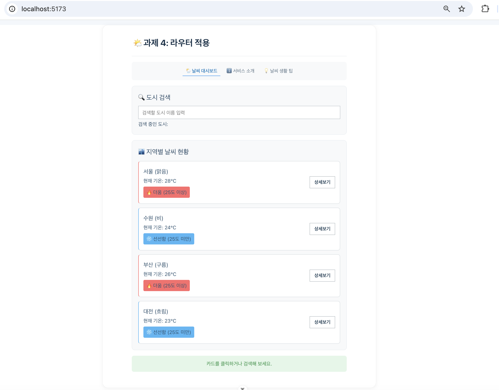
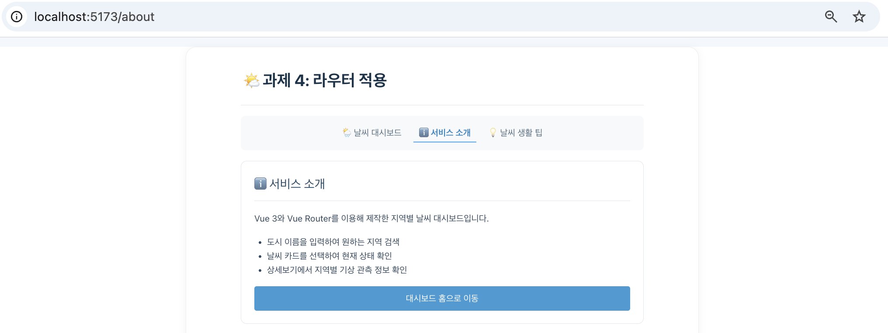
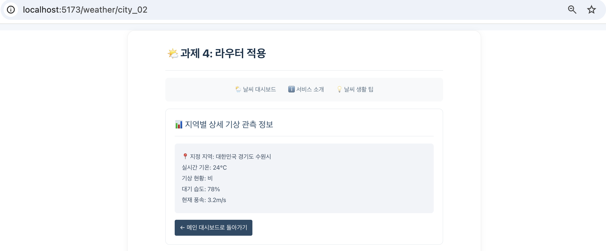
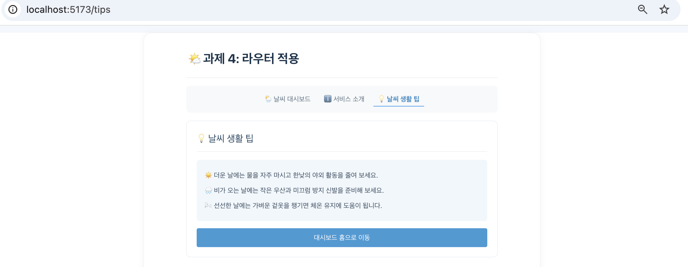
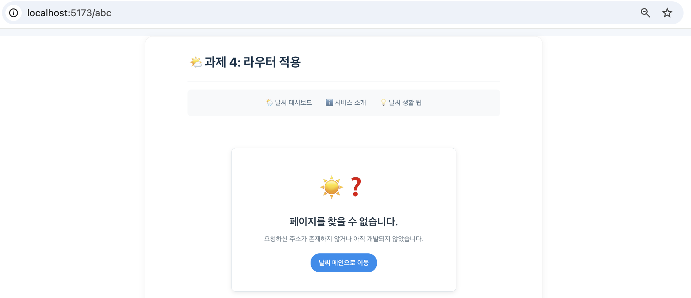

#### 배운 점

1. `RouterLink`와 `RouterView`의 역할

   `RouterLink`는 페이지를 새로 불러오지 않고 주소를 변경하며, `RouterView`는 현재 주소와 일치하는 View 컴포넌트를 표시한다. 공통 제목과 내비게이션은 `App.vue`에 한 번만 작성하고 바뀌는 화면만 `RouterView`에 출력할 수 있었다.

2. 동적 경로와 프로그래밍 방식 이동

   상세보기 버튼에서 `router.push()`로 도시 ID가 포함된 주소를 만들고, 상세 View에서는 `route.params.cityId`로 해당 값을 받았다. 하나의 상세 View를 여러 도시가 함께 사용하면서도 도시 ID에 맞는 정보를 각각 표시할 수 있다는 점을 배웠다.

### 6. 과제 5 Weather Store

파일 위치:

- `src/stores/configStore.js`
- `src/components/exercise/UnitToggler.vue`

Pinia Store에서 날씨 단위를 관리하고, 내비게이션 옆의 버튼으로 섭씨와 화씨를 변경할 수 있도록 구현했다.

#### 날씨 단위 Store

`unit`은 현재 단위를 저장하고, `unitSymbol`은 단위에 맞는 기호를 반환한다. `toggleUnit()`은 섭씨와 화씨를 전환한다.

```js
const unit = ref('celsius')

const unitSymbol = computed(() => {
  if (unit.value === 'fahrenheit') {
    return '℉'
  }

  return '℃'
})

function toggleUnit() {
  if (unit.value === 'celsius') {
    unit.value = 'fahrenheit'
  } else {
    unit.value = 'celsius'
  }
}
```

#### UnitToggler.vue

`UnitToggler.vue`에서 `configStore`를 사용하여 현재 날씨 단위를 보여주고 Action을 호출한다.

```html
<div class="unit-toggler">
  <p>날씨 단위: {{ configStore.unitSymbol }}</p>
  <button type="button" @click="configStore.toggleUnit">단위 변경</button>
</div>
```

#### 메인과 상세 날씨의 단위 변경

원본 데이터는 섭씨로 유지한다. 현재 단위가 화씨이면 `computed`에서 화씨로 변환하고, 섭씨이면 원본 값을 반환한다. 같은 기능을 `WeatherCard.vue`와 `WeatherDetailView.vue`에 각각 적용했다.

```js
const displayTemp = computed(() => {
  const rawTemp = props.weather.temp

  if (configStore.unit === 'fahrenheit') {
    return Math.round((rawTemp * 9) / 5 + 32)
  }

  return rawTemp
})
```

#### 나만의 Store 기능

날씨 상태와 온도 라벨을 표시하거나 숨길 수 있도록 `showWeatherStatus` state, `weatherStatusButtonText` getter, `toggleWeatherStatus()` action을 `configStore`에 추가했다. 이 설정은 메인 날씨 카드와 상세 날씨에 함께 적용된다.

```js
const showWeatherStatus = ref(true)

const weatherStatusButtonText = computed(() => {
  if (showWeatherStatus.value) {
    return '날씨 상태 숨기기'
  }

  return '날씨 상태 표시'
})

function toggleWeatherStatus() {
  showWeatherStatus.value = !showWeatherStatus.value
}
```

#### 실행 화면

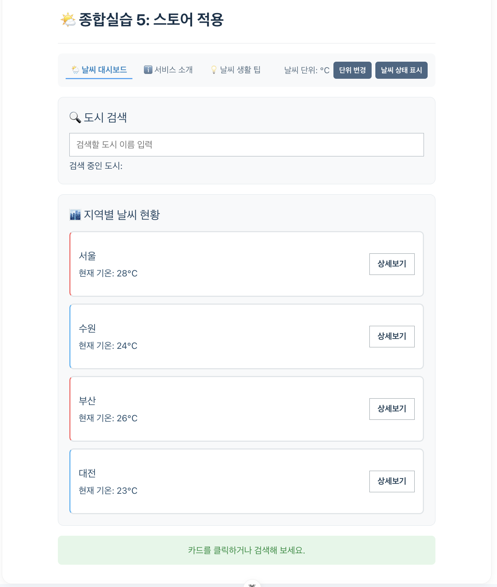
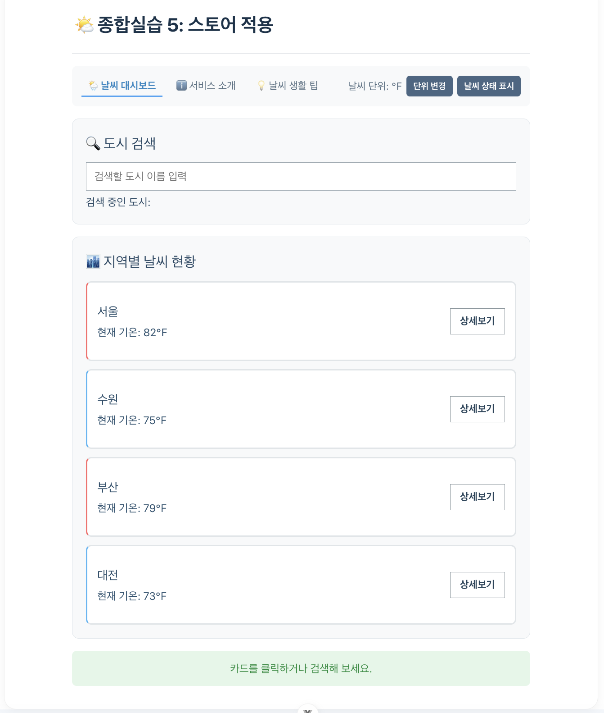
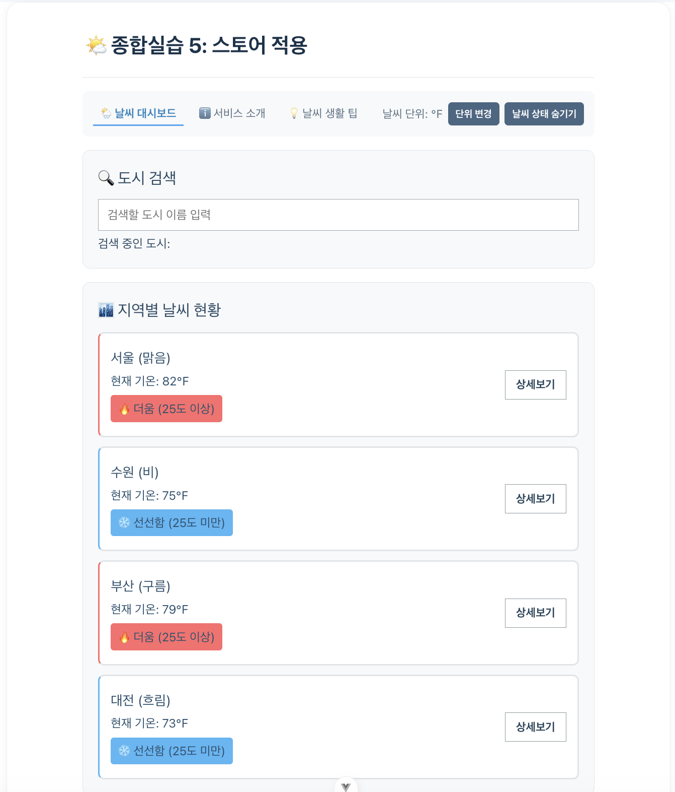

#### 배운 점

1. Pinia Store를 사용하면 여러 컴포넌트가 같은 상태를 공유할 수 있다. `UnitToggler.vue`에서 단위를 변경하면 메인 날씨 카드와 상세 날씨의 온도가 함께 변경되었다.

2. Store의 state는 원본 상태, getter는 state를 이용한 계산 결과, action은 state를 변경하는 기능을 담당한다. 각 역할을 분리하여 단위와 날씨 상태 표시 설정을 관리할 수 있었다.

### 7. 과제 6 Weather Axios

Axios와 OpenWeather API를 사용하여 Mock Data를 실제 날씨 데이터로 변경했다. API를 호출하는 Vue 파일의 `<script setup>` 영역에 `API_KEY`를 선언하여 사용했다.

```js
const API_KEY = '~'
```

`~` 위치에 발급받은 OpenWeather API Key를 입력하여 현재 날씨와 예보 API 요청에 사용한다.

#### OpenWeather 현재 날씨 API

`WeatherHomeView.vue`가 화면에 표시되면 서울, 수원, 부산, 대전의 실제 현재 날씨를 가져온다. API에는 위도와 경도, API Key, 섭씨 단위와 한글 응답 설정을 전달한다.

```js
const response = await axios.get(WEATHER_URL, {
  params: {
    lat: city.lat,
    lon: city.lon,
    appid: API_KEY,
    units: 'metric',
    lang: 'kr',
  },
})
```

응답 데이터의 기온, 날씨 설명, 습도, 풍속을 날씨 카드에 표시한다. 통신 중에는 로딩 문구를 표시하고 실패하면 다시 불러오기 버튼을 제공한다.

#### OpenWeather 추가 API

상세 페이지에서 OpenWeather의 5일/3시간 예보 API를 추가로 호출한다. 응답 목록 중 가까운 네 시간대의 기온과 날씨 상태를 화면에 표시한다.

```js
const forecastResponse = await axios.get(FORECAST_URL, {
  params: {
    lat: targetCity.lat,
    lon: targetCity.lon,
    appid: API_KEY,
    units: 'metric',
    lang: 'kr',
  },
})
```

#### 외부 API 추가

별도의 Key가 필요하지 않은 Open-Meteo Air Quality API를 추가했다. 상세 페이지에서 선택된 도시의 통합 대기질 지수, 미세먼지와 초미세먼지 수치를 표시한다.

```js
const airQualityResponse = await axios.get(AIR_QUALITY_URL, {
  params: {
    latitude: targetCity.lat,
    longitude: targetCity.lon,
    current: 'pm10,pm2_5,us_aqi',
  },
})
```

#### 카카오맵에서 날씨 찾기

외부 API 기능으로 카카오맵을 추가했다. Vue 파일에 카카오 JavaScript 키를 직접 선언하여 지도 SDK를 불러왔다.

```js
const KAKAO_MAP_API_KEY = '~'
```

카카오맵 SDK를 불러온 후 지도를 클릭하면 클릭 이벤트에서 위도와 경도를 얻는다. 클릭한 위치로 마커를 이동하고, 카카오 좌표 변환 서비스로 행정구역 이름을 가져온다.

```js
kakao.maps.event.addListener(map, 'click', (mouseEvent) => {
  const position = mouseEvent.latLng
  const lat = position.getLat()
  const lon = position.getLng()

  marker.setPosition(position)
  fetchWeather(lat, lon)
})
```

클릭한 위도와 경도를 OpenWeather 현재 날씨 API에 전달하여 해당 지역의 기온, 날씨 상태, 습도와 풍속을 지도 아래에 표시한다.

지도에서 조회한 기온도 지역별 날씨 카드와 같은 기준을 적용한다. 원본 섭씨 기온이 25도 이상이면 `🔥 더움 (25도 이상)`, 25도 미만이면 `❄️ 선선함 (25도 미만)` 라벨을 표시한다.

지도 아래 날씨 카드의 상세보기 버튼을 누르면 선택한 위도와 경도가 포함된 동적 경로로 이동한다.

```js
router.push('/map-weather/' + lat + '/' + lon + '?region=' + region)
```

`MapWeatherDetailView.vue`에서는 경로의 `lat`, `lon`을 사용하여 선택 위치의 현재 날씨, 시간대별 예보와 대기질 정보를 다시 조회한다. 따라서 미리 등록한 네 도시뿐만 아니라 지도에서 선택한 위치도 별도의 상세 페이지로 확인할 수 있다.

#### 실행 화면

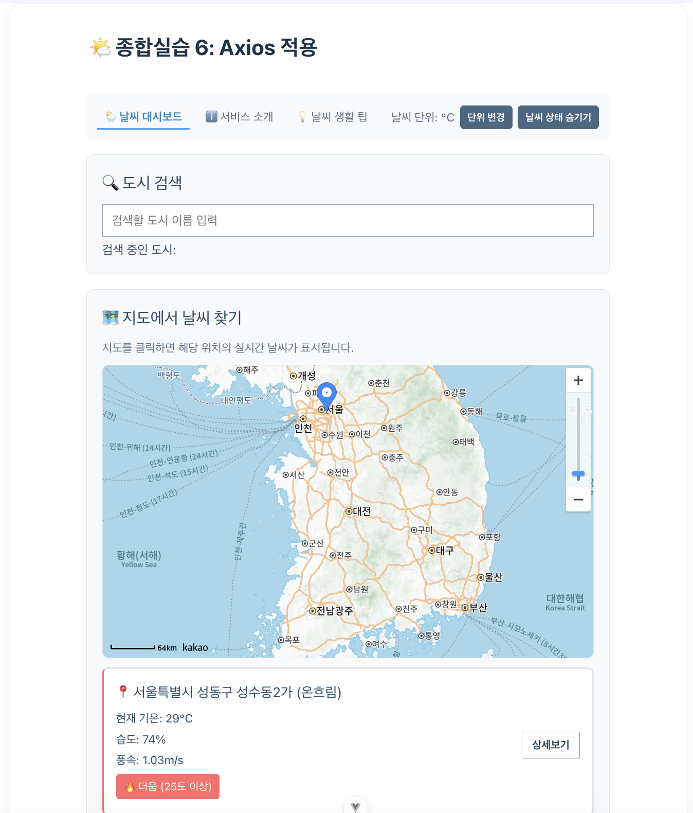
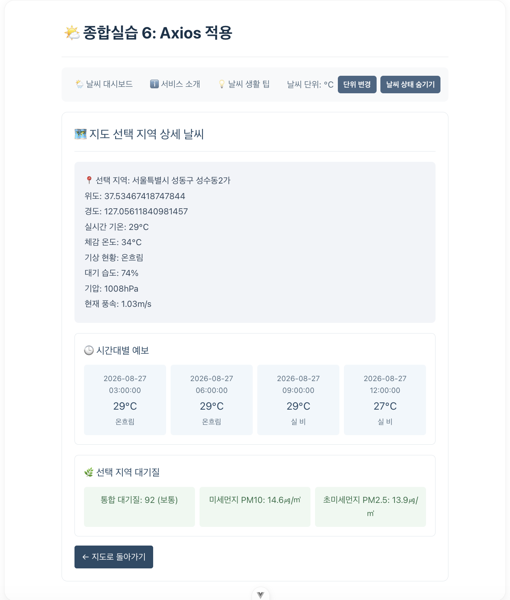

#### 배운 점

1. `axios.get()`에 `params`를 전달하면 요청 주소의 Query String을 직접 연결하지 않고도 필요한 값을 API에 전달할 수 있다. Axios는 응답 JSON을 자동으로 변환하여 `response.data`로 제공한다.

2. `async/await`로 API 응답을 기다리고 `try/catch/finally`를 이용해 성공, 실패, 로딩 종료 상태를 나누어 처리할 수 있었다. 지도 클릭 이벤트에서 얻은 좌표도 OpenWeather API의 요청 값으로 사용할 수 있었다.

### 8. 과제 7 Weather UI Library

외부 UI Library로 Vue 3에서 사용할 수 있는 Element Plus를 선정했다. 기존 날씨 데이터, Router, Store, Axios와 카카오맵 기능은 유지하고 버튼과 상태 표시 디자인에 Element Plus 컴포넌트를 적용했다.

#### Element Plus 설치 및 등록

다음 명령어로 Element Plus를 설치했다.

```sh
npm install element-plus
```

`main.js`에서 Element Plus와 CSS를 불러오고 Vue Application에 등록했다.

```js
import ElementPlus from 'element-plus'
import 'element-plus/dist/index.css'

app.use(ElementPlus)
```

#### Button 적용

날씨 단위 변경, 날씨 상태 표시 변경, 날씨 상세보기와 API 다시 불러오기 버튼을 `el-button`으로 변경했다. `type`, `plain`, `size` 속성을 이용하여 버튼의 역할에 맞는 디자인을 적용했다.

```html
<el-button type="primary" size="small" @click="configStore.toggleUnit"> 단위 변경 </el-button>

<el-button type="primary" plain @click="showDetail">상세보기</el-button>
```

#### Tag 적용

지역별 날씨와 지도에서 선택한 날씨의 온도 라벨을 `el-tag`로 변경했다. 25도 이상은 `danger`, 25도 미만은 `primary` 타입을 적용했다.

```html
<el-tag v-if="weather.temp >= 25" type="danger" effect="dark"> 🔥 더움 (25도 이상) </el-tag>
<el-tag v-else type="primary" effect="dark">❄️ 선선함 (25도 미만)</el-tag>
```

#### API 상태 표시

Axios 통신 중에는 `el-skeleton`, 통신 실패 시에는 `el-alert`, 검색 결과가 없을 때는 `el-empty`를 표시한다.

```html
<el-skeleton v-if="isLoading" :rows="4" animated />

<el-alert v-else-if="errorMessage" :title="errorMessage" type="error" :closable="false" show-icon />

<el-empty description="검색 결과와 일치하는 도시가 없습니다." />
```

#### 기존 API 기능 유지

- OpenWeather 현재 날씨 API로 서울, 수원, 부산, 대전의 실제 날씨 표시
- OpenWeather 5일/3시간 예보 API로 상세 예보 표시
- Open-Meteo Air Quality API로 대기질과 미세먼지 표시
- 카카오맵에서 선택한 좌표의 현재 날씨와 상세 날씨 표시

#### 실행 화면

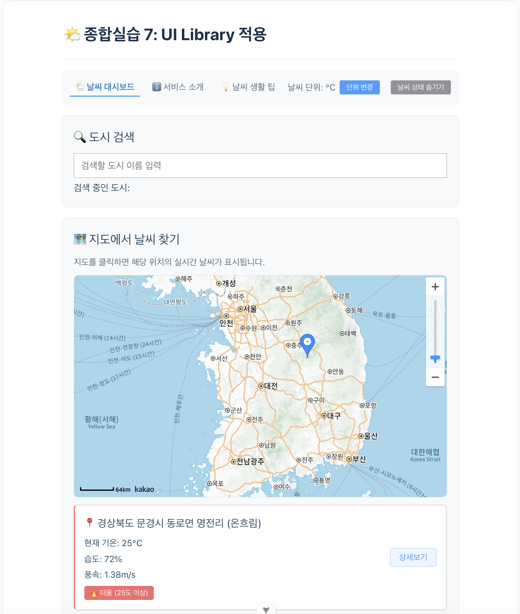
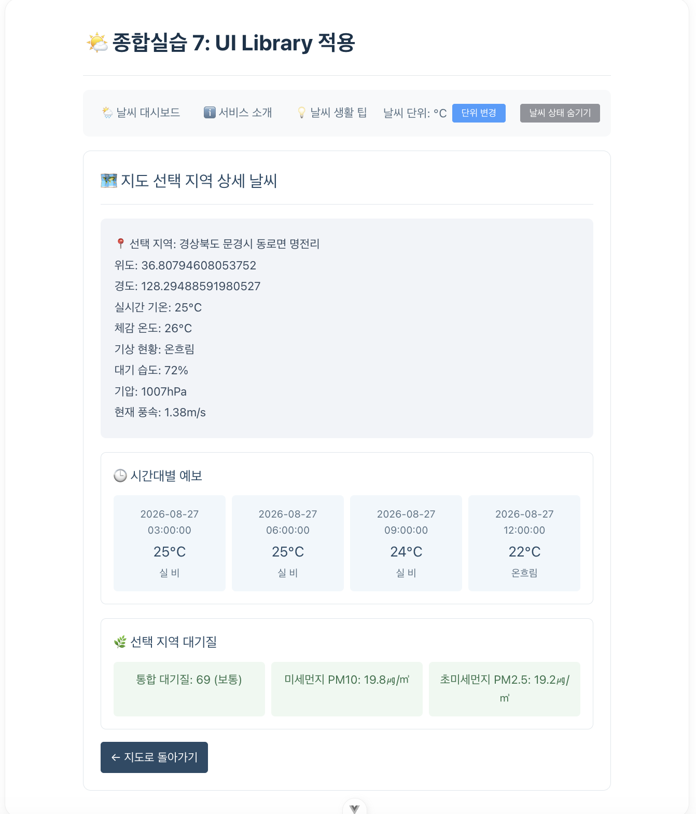

#### 배운 점

1. 외부 UI Library를 Vue Application에 전역 등록하면 각 컴포넌트에서 별도의 import 없이 `el-button`, `el-tag` 등의 컴포넌트를 사용할 수 있었다.

2. 직접 CSS를 작성했던 버튼과 라벨을 UI 컴포넌트로 변경하고 속성으로 상태별 디자인을 지정할 수 있었다. 또한 Skeleton, Alert, Empty 컴포넌트를 사용하여 API의 로딩, 실패, 빈 결과 상태를 구분해서 보여줄 수 있었다.

### 9. 과제 8 Weather Deployment

제출할 Source Code의 품질을 점검하고 API Key를 환경 변수로 분리했다. 이후 Project를 Build하여 서버에 Hosting할 수 있는 정적 파일을 생성했다.

#### ESLint 품질 점검

다음 명령어로 Oxlint와 ESLint를 함께 실행하여 Source Code의 Error를 점검했다.

```sh
npm run lint
```

`package.json`의 `lint` 명령어는 `lint:oxlint`와 `lint:eslint`을 차례대로 실행한다.

```json
"lint": "run-s \"lint:*\"",
"lint:oxlint": "oxlint . --fix",
"lint:eslint": "eslint . --fix --cache"
```

#### API Key 환경 변수 분리

OpenWeather API Key와 카카오맵 JavaScript Key를 Vue 파일에서 제거하고 Project Root의 `.env` 파일로 옮겼다.

```env
VITE_OPENWEATHER_API_KEY=발급받은_OpenWeather_API_Key
VITE_KAKAO_MAP_API_KEY=발급받은_Kakao_JavaScript_Key
```

Vue 파일에서는 실제 Key를 직접 작성하지 않고 `import.meta.env`로 환경 변수를 가져온다.

```js
const OPEN_WEATHER_API_KEY = import.meta.env.VITE_OPENWEATHER_API_KEY
const KAKAO_MAP_API_KEY = import.meta.env.VITE_KAKAO_MAP_API_KEY
```

`.gitignore`에 `.env`와 `.env.*`를 등록하여 실제 API Key가 Git에 업로드되지 않도록 했다. 변수 이름만 작성된 `.env.example`은 다른 환경에서도 필요한 설정을 알 수 있도록 Git에 포함한다.

```gitignore
.env
.env.*
!.env.example
```

#### Build

다음 명령어로 배포용 정적 파일을 생성한다.

```sh
npm run build
```

Build가 완료되면 생성되는 `dist` 폴더에는 서버에 Hosting할 수 있는 HTML, CSS와 JavaScript 파일이 들어 있다. `dist`는 Build할 때 다시 생성할 수 있으므로 Git에는 업로드하지 않는다.

#### 품질 점검 및 Build 결과

- `npm run lint`: Oxlint와 ESLint Error 없이 완료
- `npm run build`: Vite Production Build 완료 및 `dist` 생성
- `npm run preview`: Build 결과를 로컬 정적 서버에서 실행하고 HTTP 응답 확인

#### Hosting 및 확인

배포 서버에는 Project 전체가 아니라 `dist` 폴더 내부의 정적 파일을 Hosting한다. 서버의 환경 변수에 `.env`와 같은 변수 이름으로 실제 API Key를 등록한 다음 Build해야 한다.

GitHub Pages를 Hosting 서버로 사용한다. `main` Branch에 Source Code를 Push하면 GitHub Actions가 ESLint 점검과 Build를 실행하고, 생성된 `dist`를 GitHub Pages에 배포한다.

```text
https://ymj9608.github.io/skala-vue/
```

Repository의 `Settings → Secrets and variables → Actions`에 다음 Repository Secret을 등록하여 Build 과정에서 API Key를 환경 변수로 전달한다.

- `VITE_OPENWEATHER_API_KEY`
- `VITE_KAKAO_MAP_API_KEY`

GitHub Pages의 Project 경로에서 CSS와 JavaScript 파일을 불러올 수 있도록 `vite.config.js`에 `base`를 설정했다.

```js
base: '/skala-vue/'
```

상세 페이지에서 새로고침했을 때 정적 Hosting 서버의 404가 발생하지 않도록 Router를 Hash 방식으로 설정했다.

```js
history: createWebHashHistory(import.meta.env.BASE_URL)
```

Hash 뒤의 경로는 서버에 요청되지 않으므로 GitHub Pages에서 상세 페이지를 새로고침해도 Application의 `index.html`을 정상적으로 불러올 수 있다. 배포 후에는 다음 항목을 확인한다.

1. 배포 주소에서 날씨 대시보드가 정상적으로 표시되는지 확인한다.
2. OpenWeather 현재 날씨와 예보 데이터가 표시되는지 확인한다.
3. 카카오 개발자 Console에 배포 Domain을 등록하고 지도가 표시되는지 확인한다.
4. 지도에서 위치를 선택한 후 상세 페이지로 이동되는지 확인한다.

#### 실행 화면

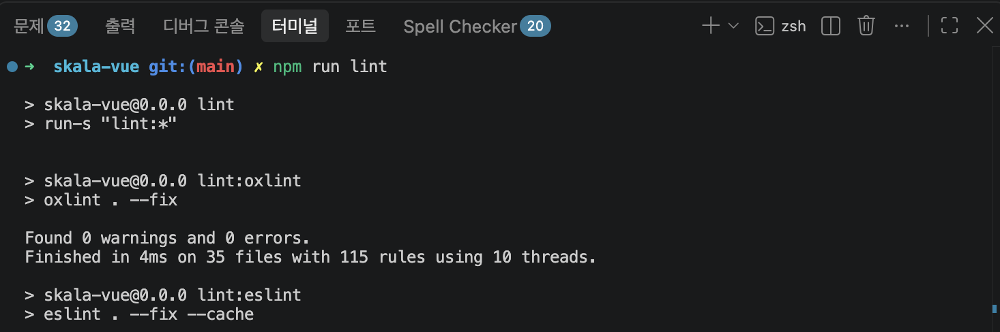
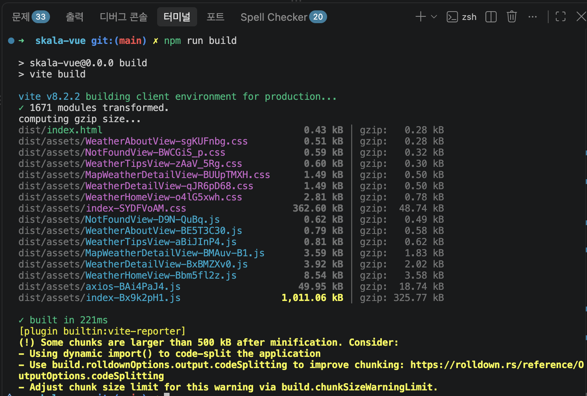
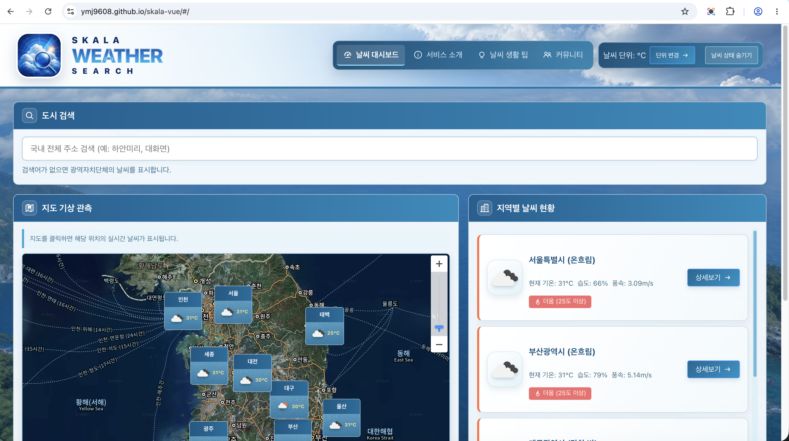

#### 배운 점

1. API Key를 `.env`로 분리하고 `.gitignore`에 등록하면 Source Code와 Git 저장소에 실제 Key를 작성하지 않고 환경마다 다른 값을 사용할 수 있다.

2. ESLint는 Build 전에 Source Code의 문제를 확인하고, Build는 Vue Source Code를 서버에서 제공할 수 있는 정적 파일로 변환한다. 배포 서버에는 생성된 `dist` 폴더의 파일을 사용한다.
